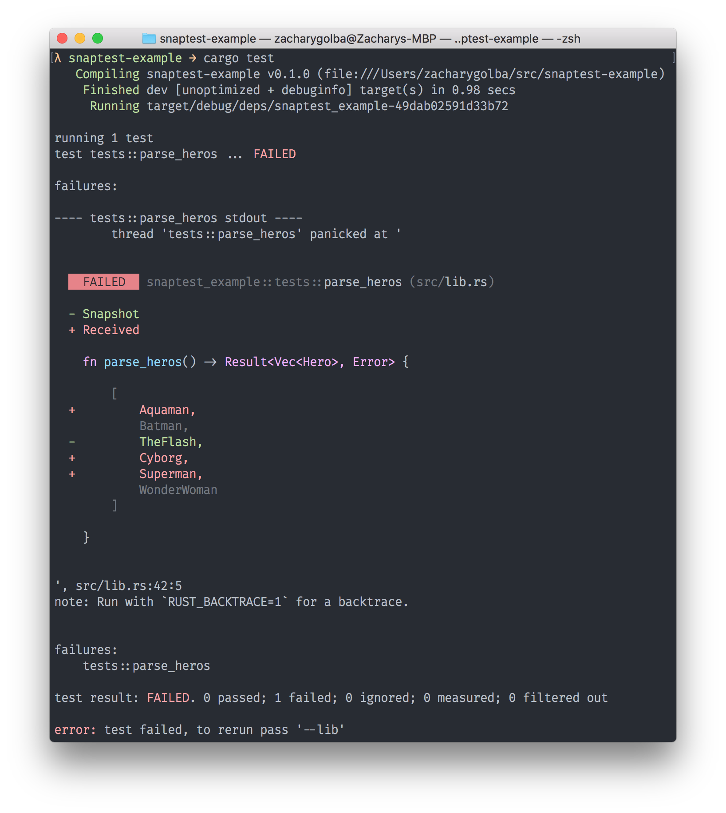

# snaptest

[](https://circleci.com/gh/zacharygolba/snaptest/tree/master) [](https://ci.appveyor.com/project/zacharygolba/snaptest/branch/master) [](https://crates.io/crates/snaptest)

Dead simple snapshot testing (inspired by [jest](https://facebook.github.io/jest/)).

Documentation (including this README) is a work in progress. Feel free to submit an issue if you have a question about usage.

## Features

- Any type that implements [`Debug`](https://doc.rust-lang.org/std/fmt/trait.Debug.html) can be returned from a test.
- First class integration with [`failure`](https://boats.gitlab.io/failure/).
- The snapshot store is thread safe so your tests can run in parallel.
- Beautiful diffs are printed when a snapshot test fails.
- A single small binary file is used to store snapshots.

TODO

## Installation

First, add `snaptest` to the dependencies section of your `Cargo.toml`:

```toml
[dependencies]
snaptest = "0.1"
```

Next, add the following snippet to the entry point of your crate (`lib.rs` or `main.rs`):

```rust
#[macro_use]
extern crate snaptest;
```

## Usage

Derive `Debug` on types that you want to use with snaptest:

```rust
#[macro_use]
extern crate failure;
#[cfg_attr(test, macro_use)]
extern crate snaptest;

use std::str::FromStr;

#[derive(Debug)]
enum Hero {
    Batman,
    TheFlash,
    WonderWoman,
}

impl FromStr for Hero {
    type Err = Error;

    fn from_str(value: &str) -> Result<Hero, Self::Err> {
        match value {
            "Batman" => Ok(Hero::Batman),
            "The Flash" => Ok(Hero::TheFlash),
            "Wonder Woman" => Ok(Hero::WonderWoman),
            _ => bail!(r#""{}" is not a hero"#),
        }
    }
}

#[cfg(test)]
mod tests {
    use failure::Error;

    use super::Hero; // no pun intended...

    snaptest!{
        fn parse_heros() -> Result<Vec<Hero>, Error> {
            let heros = ["Batman", "The Flash", "Wonder Woman"];
            heros.iter().map(|hero| hero.parse()).collect()
        }
    }
}
```

Next time your test runs, a snapshot will be added to a local `.snapfile` to compare against future test results. If you get a different result back than what matches the snapshot, the test will fail and the diff will be printed to the console.

<p align="center">
  
</p>

## License

Licensed under either of

* Apache License, Version 2.0
  ([LICENSE-APACHE](LICENSE-APACHE) or http://www.apache.org/licenses/LICENSE-2.0)
* MIT license
  ([LICENSE-MIT](LICENSE-MIT) or http://opensource.org/licenses/MIT)

at your option.

## Contribution

Unless you explicitly state otherwise, any contribution intentionally submitted
for inclusion in the work by you, as defined in the Apache-2.0 license, shall be
dual licensed as above, without any additional terms or conditions.
